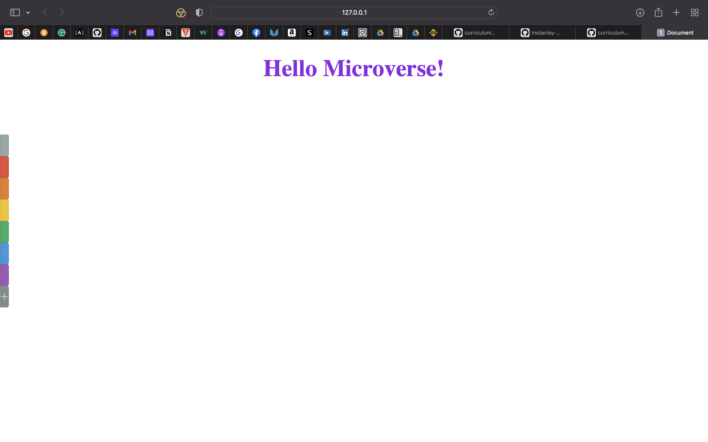

# microverse-linters-project

> This is a sample HTML and CSS project



## Built With

- HTML 
- CSS
- Linters

## Live Demo

[Live Demo Link](https://stanleySimeon.github.io/microverse-linters-project/)


## Getting Started

To get a local copy up and running follow these simple example steps.

```sh
 - git clone https://github.com/stanleySimeon/microverse-linters-project.git
 - Navigate to the project directory. 
   Example: cd Desktop/microverse-linters-project
 - run VS Code live server
 - Navigate to your browser and type the localhost:port_number (localhost:5500)
 ```

## Authors

 👤 **Stanley SIMEON**
- GitHub: [Github](https://github.com/stanleySimeon)
- Twitter: [Twitter](https://twitter.com/mstanleyme)
- LinkedIn: [LinkedIn](https://www.linkedin.com/in/stanleysimeon/)

## 🤝 Contributing

Contributions, issues, and feature requests are welcome!

## Show your support

If you like this project gice your support by giving a like.
